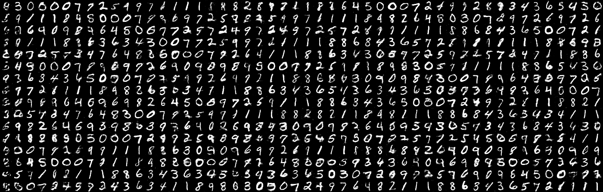
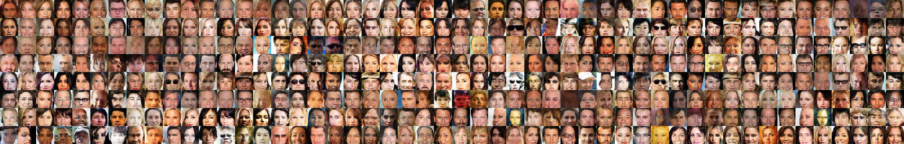
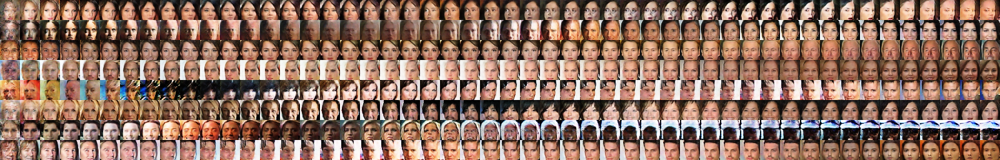

# Markov Chain GAN (MGAN)
TensorFlow code for [Generative Adversarial Training for Markov Chains](https://openreview.net/pdf?id=S1L-hCNtl) (ICLR 2017 Workshop Track).

Work by [Jiaming Song](http://tsong.me), [Shengjia Zhao](http://szhao.me) and [Stefano Ermon](http://cs.stanford.edu/~ermon).

<br/>

## Preprocessing
Running the code requires some preprocessing.
Namely, we transform the data to TensorFlow Records file to maximize speed 
(as [suggested by TensorFlow](https://www.tensorflow.org/performance/performance_guide)).

### MNIST
The data used for training is [here](https://drive.google.com/open?id=0B0LzoDno7qkJdDluZW5DSnpyWTg).
Download and place the directory in `~/data/mnist_tfrecords`. 

(This can be easily done by using a symlink or you can change the path in file `models/mnist/__init__.py`)

### CelebA
The data used for training is [here](https://drive.google.com/open?id=0B0LzoDno7qkJX3p2YS1DODNrM3c).
Download and place the directory in `~/data/celeba_tfrecords`.

<br/>

## Running Experiments
```
python mgan.py [data] [model] -b [B] -m [M] -d [critic iterations] --gpus [gpus]
```
where `B` defines the steps from noise to data, `M` defines the steps from data to data, and `[gpus]` defines the `CUDA_VISIBLE_DEVICES` environment variable.

### MNIST
```
python mgan.py mnist mlp -b 4 -m 3 -d 7 --gpus [gpus]
```

### CelebA
Without shortcut connections:
```
python mgan.py celeba conv -b 4 -m 3 -d 7 --gpus [gpus]
```

With shortcut connections (will observe a much slower transition):
```
python mgan.py celeba conv_res -b 4 -m 3 -d 7 --gpus [gpus]
```

### Custom Experiments
It is easy to define your own problem and run experiments.
- Create a folder `data` under the `models` directory, and define `data_sampler` and `noise_sampler` in `__init__.py`.
- Create a file `model.py` under the `models/data` directory, and define the following:
  - `class TransitionFunction(TransitionBase)` (Generator)
  - `class Discriminator(DiscriminatorBase)` (Discriminator)
  - `def visualizer(model, name)` (If you need to generate figures)
  - `epoch_size` and `logging_freq`
- That's it!

<br/>

## Figures
Each row is from a single chain, where we sample for 50 time steps.

### MNIST


### CelebA
Without shortcut connections:


With shortcut connections:


## Contact
[tsong@cs.stanford.edu](mailto:tsong@cs.stanford.edu)
